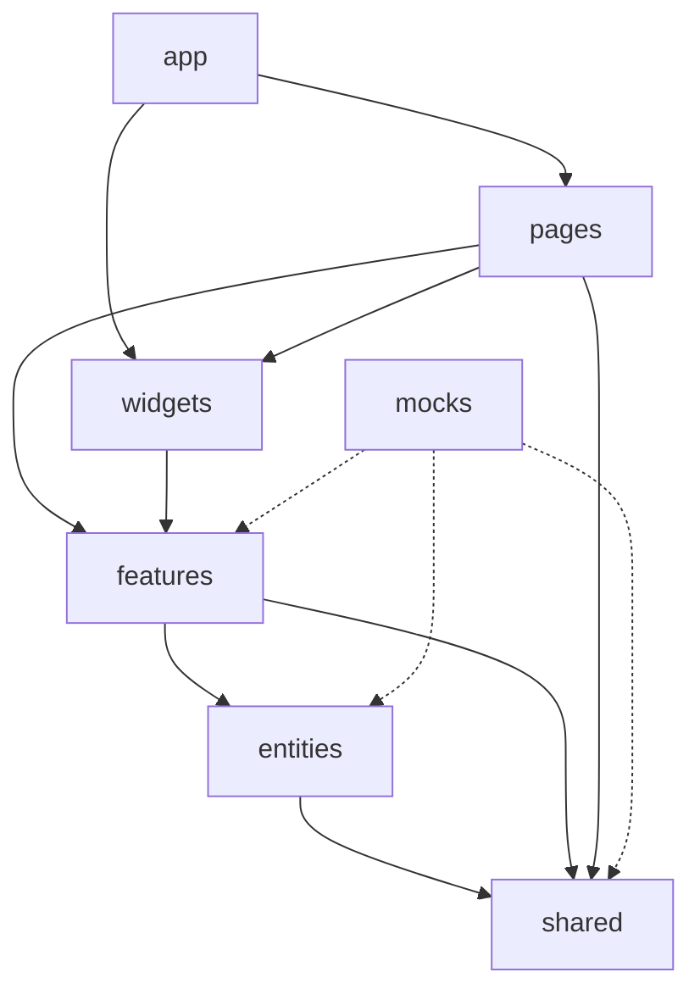

# ODA 02 — Feature-Sliced Design e fronteiras impostas pelo ESLint

## Objetivos de aprendizagem

- [ ] Explicar a hierarquia de camadas do Feature-Sliced Design adotada pelo shell.
- [ ] Classificar uma importação entre camadas como permitida ou proibida segundo `eslint.config.ts`.
- [ ] Executar o lint e interpretar o erro `boundaries/dependencies`.
- [ ] Justificar a imposição automática das fronteiras em relação à revisão manual, com base na ADR-007.

## Conceito

O shell do `frontend-react` organiza o código segundo o Feature-Sliced Design (FSD), que divide a aplicação em camadas com responsabilidade definida e dependência em uma só direção. A camada `app` inicializa a aplicação, `pages` compõe as telas, `widgets` reúne blocos de interface, `features` implementa ações do usuário, `entities` representa conceitos de negócio e `shared` guarda a infraestrutura reutilizável, como o cliente HTTP e a configuração.

A regra central é que cada camada importa somente das camadas abaixo dela. A camada `shared` fica na base e não importa de nenhuma outra camada. A camada `mocks`, que simula o back-end em desenvolvimento e nos testes, é uma exceção declarada e pode importar de `shared`, `entities` e `features`, para que os simuladores reproduzam o comportamento real.



O diagrama mostra as dependências diretas mais usadas. A configuração também autoriza saltos de camada, como `app` para `shared` e `pages` para `entities`, desde que a direção seja sempre descendente.

No commit de referência, o diretório `src/` contém as camadas `app`, `features`, `mocks`, `pages` e `shared`. As camadas `widgets` e `entities` estão declaradas na configuração, mas ainda não têm código, o que permite criá-las sem alterar as regras.

A verificação é feita pelo plugin `eslint-plugin-boundaries`. O plugin associa cada arquivo a um elemento pelo padrão de caminho e compara cada importação com a lista de dependências permitidas. Importações dentro de uma mesma camada não são verificadas, e por isso `src/shared/api/httpClient.ts` importa `@/shared/auth/tokenStorage` e `@/shared/config` sem nenhum erro de lint no commit de referência.

## No código

A configuração declara os elementos e as regras de dependência. A regra de `shared` proíbe qualquer destino, e as demais listam explicitamente as camadas permitidas, com `default: 'disallow'` para o que não estiver listado.

Arquivo: `eslint.config.ts` (commit `2179313`)

```ts
      'boundaries/elements': [
        { type: 'shared',   pattern: 'src/shared/**' },
        { type: 'entities', pattern: 'src/entities/**' },
        { type: 'features', pattern: 'src/features/**' },
        { type: 'widgets',  pattern: 'src/widgets/**' },
        { type: 'pages',    pattern: 'src/pages/**' },
        { type: 'app',      pattern: 'src/app/**' },
        { type: 'mocks',    pattern: 'src/mocks/**' },
      ],
      'boundaries/ignore': ['src/main.tsx', 'src/test-setup.ts'],
    },
    rules: {
      ...reactHooks.configs.recommended.rules,
      '@typescript-eslint/no-unused-vars': ['error', { argsIgnorePattern: '^_' }],
      'boundaries/dependencies': ['error', {
        default: 'disallow',
        rules: [
          { from: { type: 'shared' },   disallow: { to: { type: '*' } } },
          { from: { type: 'entities' }, allow: { to: { type: ['shared'] } } },
          { from: { type: 'features' }, allow: { to: { type: ['entities', 'shared'] } } },
          { from: { type: 'widgets' },  allow: { to: { type: ['features', 'entities', 'shared'] } } },
          { from: { type: 'pages' },    allow: { to: { type: ['widgets', 'features', 'entities', 'shared'] } } },
          { from: { type: 'app' },      allow: { to: { type: ['pages', 'widgets', 'features', 'entities', 'shared'] } } },
          { from: { type: 'mocks' },    allow: { to: { type: ['shared', 'entities', 'features'] } } },
        ],
      }],
```

A página de login mostra duas dependências permitidas: `pages` importa de `shared` (a fatia de autenticação do Redux e o botão) e de `features` (a chamada de login).

Arquivo: `src/pages/login/index.tsx` (commit `2179313`)

```tsx
import { login } from '@/shared/lib/store/authSlice'
import { loginRequest } from '@/features/auth/loginRequest'
import { Button } from '@/shared/ui/Button/Button'
```

## Simulador

O classificador apresenta importações entre camadas. Algumas existem no repositório e outras foram construídas para o exercício, todas avaliadas segundo as regras de `eslint.config.ts`.

<div data-oda="classificador">
<script type="application/json">
{"enunciado": "Classifique cada importação segundo as regras de `eslint.config.ts`.",
 "categorias": [{"id": "permitida", "rotulo": "Permitida"}, {"id": "proibida", "rotulo": "Proibida"}],
 "itens": [
  {"texto": "`src/pages/login/index.tsx` importa `@/features/auth/loginRequest`", "categoria": "permitida", "explicacao": "`pages` pode importar de `widgets`, `features`, `entities` e `shared`."},
  {"texto": "`src/features/auth/loginRequest.ts` importa `@/shared/config`", "categoria": "permitida", "explicacao": "`features` pode importar de `entities` e `shared`."},
  {"texto": "`src/shared/api/httpClient.ts` importa `@/features/auth/loginRequest`", "categoria": "proibida", "explicacao": "A regra de `shared` proíbe importar de qualquer outra camada."},
  {"texto": "`src/features/auth/loginRequest.ts` importa `@/pages/login`", "categoria": "proibida", "explicacao": "`features` não importa camadas superiores, como `pages`."},
  {"texto": "`src/app/router/index.tsx` importa `@/pages/dashboard`", "categoria": "permitida", "explicacao": "`app` é a camada superior e pode importar de todas as demais."},
  {"texto": "`src/mocks/handlers.ts` importa `@/features/auth/loginRequest`", "categoria": "permitida", "explicacao": "A camada `mocks` tem permissão explícita para `shared`, `entities` e `features`."},
  {"texto": "`src/mocks/handlers.ts` importa `@/pages/login`", "categoria": "proibida", "explicacao": "A permissão de `mocks` não inclui `pages`."},
  {"texto": "`src/pages/dashboard/index.tsx` importa `@/app/router/routes`", "categoria": "proibida", "explicacao": "`pages` não importa de `app`, que fica acima dela."}
 ]}
</script>
</div>

O terminal reproduz a sequência do laboratório com as saídas obtidas no commit de referência. O caminho absoluto do arquivo foi abreviado.

<div data-oda="terminal">
<script type="application/json">
{"titulo": "Lint antes, durante e depois da violação",
 "passos": [
  {"comando": "npm run lint", "saida": "> frontend-react@0.0.0 lint\n> eslint src/", "nota": "Sem erros: o código do commit de referência respeita as fronteiras."},
  {"comando": "npm run lint", "saida": "> frontend-react@0.0.0 lint\n> eslint src/\n\n.../frontend-react/src/shared/api/httpClient.ts\n  4:30  error  Dependencies to elements of type \"features\" are not allowed in elements of type \"shared\". Denied by rule at index 0  boundaries/dependencies\n\n✖ 1 problem (1 error, 0 warnings)", "nota": "Depois de acrescentar a importação de `@/features/auth/loginRequest` em `src/shared/api/httpClient.ts`. A mensagem indica linha e coluna, a camada de origem, a camada de destino e a posição da regra em `rules`."},
  {"comando": "git checkout -- src/shared/api/httpClient.ts", "saida": ""},
  {"comando": "npm run lint", "saida": "> frontend-react@0.0.0 lint\n> eslint src/", "nota": "Com a importação removida, o lint volta a terminar sem erros."}
 ]}
</script>
</div>

## Laboratório

O laboratório usa o repositório no commit de referência e exige Node 24 e npm. Os comandos são iguais em Windows, Linux e macOS.

1. Clone o repositório, posicione-o no commit de referência e instale as dependências.

    ```bash
    git clone https://github.com/arkhibr/frontend-react
    cd frontend-react
    git checkout 2179313
    npm ci
    ```

2. Execute o lint e confirme que ele termina sem erros, apenas com as duas linhas de identificação do script.

    ```bash
    npm run lint
    ```

3. Abra `src/shared/api/httpClient.ts` e acrescente, logo após a última linha de importação, as duas linhas abaixo. A segunda linha usa o valor importado, para que o erro de variável não utilizada não se misture ao erro de fronteira.

    ```ts
    import { loginRequest } from '@/features/auth/loginRequest'
    export const violacaoDeFronteira = loginRequest
    ```

4. Execute `npm run lint` outra vez. O resultado esperado é um único erro na linha 4, coluna 30, com a mensagem `Dependencies to elements of type "features" are not allowed in elements of type "shared". Denied by rule at index 0`, e código de saída 1.

5. Substitua o caminho da importação por `'../../features/auth/loginRequest'` e execute o lint de novo. O erro permanece, porque o plugin resolve o caminho relativo para o mesmo arquivo da camada `features`.

6. Desfaça a alteração e confirme o lint sem erros.

    ```bash
    git checkout -- src/shared/api/httpClient.ts
    npm run lint
    ```

## Erros comuns

| Sintoma | Causa | Correção |
| --- | --- | --- |
| Uma pasta nova em `src/`, como `src/processes/`, importa de `features` e de `pages` e o lint termina sem erros. | A pasta não corresponde a nenhum padrão de `boundaries/elements`, e o plugin não verifica arquivos fora dos elementos declarados. O comportamento foi observado no commit de referência. | Registrar a nova pasta em `boundaries/elements` e acrescentar a regra correspondente em `boundaries/dependencies`, como determina a seção de consequências da ADR-007. |
| A importação proibida gera também o erro `@typescript-eslint/no-unused-vars`. | O valor importado não é usado no arquivo. | Usar o valor importado, como no passo 3 do laboratório, para isolar o erro de fronteira. |
| A troca de `@/` por caminho relativo parece contornar a regra. | O plugin resolve o caminho relativo e identifica a camada de destino da mesma forma. | Corrigir a direção da dependência, movendo o código compartilhado para a camada inferior. |

## Decisão arquitetural

!!! abstract "ADR-007 — Tática de imposição de fronteiras arquiteturais"

    **Contexto:** o FSD, adotado na ADR-002, define regras explícitas de dependência entre camadas, e sem verificação automatizada essas regras ficam como convenção documentada que se degrada sob pressão de entrega.

    **Decisão:** adotar o `eslint-plugin-boundaries` para impor as regras de dependência do FSD como erros de lint executados na esteira de CI, com cada camada mapeada como um elemento do plugin em `eslint.config.ts`.

    **Alternativas avaliadas:** a revisão de código manual dispensa configuração, mas não escala com o crescimento do time e deixa violações passarem até o momento da revisão, enquanto a ausência de qualquer mecanismo leva ao acúmulo de importações cruzadas como dívida técnica.

    **Consequências:** os erros de fronteira aparecem no editor, quando o ESLint está integrado, e obrigatoriamente na esteira de CI, e todo novo módulo precisa ser registrado em `boundaries/elements`, enquanto a camada `mocks` mantém permissão especial para importar de `shared`, `entities` e `features`.

A escolha do FSD em si está registrada na ADR-002, que compara a metodologia com a organização por tipo técnico e aceita a curva de aprendizado inicial em troca de dependências unidirecionais verificadas automaticamente.

## Verificação

<div data-oda="quiz">
<script type="application/json">
{"perguntas": [
 {"enunciado": "Qual afirmação descreve a hierarquia de camadas do FSD adotada pelo shell?",
  "alternativas": [
   {"texto": "Cada camada importa somente das camadas abaixo dela, e `shared` não importa de nenhuma outra.", "correta": true, "explicacao": "É a regra declarada em `boundaries/dependencies`, com `shared` na base da hierarquia."},
   {"texto": "Qualquer camada pode importar de qualquer outra, desde que use o alias `@/`.", "correta": false, "explicacao": "O alias não altera a regra: o plugin identifica a camada pelo caminho resolvido."},
   {"texto": "A camada `app` só pode importar de `shared`.", "correta": false, "explicacao": "`app` pode importar de `pages`, `widgets`, `features`, `entities` e `shared`."}]},
 {"enunciado": "Como o lint classifica a importação de `@/pages/login` em `src/mocks/handlers.ts`?",
  "alternativas": [
   {"texto": "Proibida, porque a permissão de `mocks` cobre apenas `shared`, `entities` e `features`.", "correta": true, "explicacao": "A regra de `mocks` lista explicitamente as três camadas, e `default: 'disallow'` recusa as demais."},
   {"texto": "Permitida, porque `mocks` é exceção e pode importar de qualquer camada.", "correta": false, "explicacao": "A exceção de `mocks` é limitada a três camadas."},
   {"texto": "Ignorada, porque `mocks` está em `boundaries/ignore`.", "correta": false, "explicacao": "`boundaries/ignore` contém apenas `src/main.tsx` e `src/test-setup.ts`."}]},
 {"enunciado": "O lint informa `Dependencies to elements of type \"features\" are not allowed in elements of type \"shared\"`. O que essa mensagem indica?",
  "alternativas": [
   {"texto": "Um arquivo da camada `shared` importou um arquivo da camada `features`.", "correta": true, "explicacao": "A mensagem nomeia primeiro o destino (`features`) e depois a origem (`shared`)."},
   {"texto": "Um arquivo da camada `features` importou um arquivo da camada `shared`.", "correta": false, "explicacao": "Essa direção é permitida: `features` pode importar de `shared`."},
   {"texto": "O arquivo importado não existe.", "correta": false, "explicacao": "Arquivo inexistente gera erro de resolução, e não erro de fronteira."}]},
 {"enunciado": "Por que a ADR-007 prefere o plugin à revisão de código manual?",
  "alternativas": [
   {"texto": "Porque a verificação automática detecta a violação antes do merge e não depende da disciplina de cada revisor.", "correta": true, "explicacao": "A ADR-007 registra que a revisão manual não escala com o crescimento do time e deixa violações passarem."},
   {"texto": "Porque o plugin dispensa qualquer configuração.", "correta": false, "explicacao": "A ADR-007 registra como desvantagem a necessidade de mapear todos os elementos."},
   {"texto": "Porque o plugin também verifica pastas não registradas em `boundaries/elements`.", "correta": false, "explicacao": "Pastas fora dos elementos declarados não são verificadas, como mostra a seção de erros comuns."}]}
]}
</script>
</div>

## Referências

- [ADR-002 — Tática de modularização](https://github.com/arkhibr/frontend-react/blob/2179313/docs/architecture/adrs/ADR-002-modularizacao.md)
- [ADR-007 — Tática de imposição de fronteiras arquiteturais](https://github.com/arkhibr/frontend-react/blob/2179313/docs/architecture/adrs/ADR-007-imposicao-fronteiras-arquiteturais.md)
- [`eslint.config.ts` no commit de referência](https://github.com/arkhibr/frontend-react/blob/2179313/eslint.config.ts)
- [eslint-plugin-boundaries](https://github.com/javierbrea/eslint-plugin-boundaries)
- [Feature-Sliced Design](https://feature-sliced.design/)
