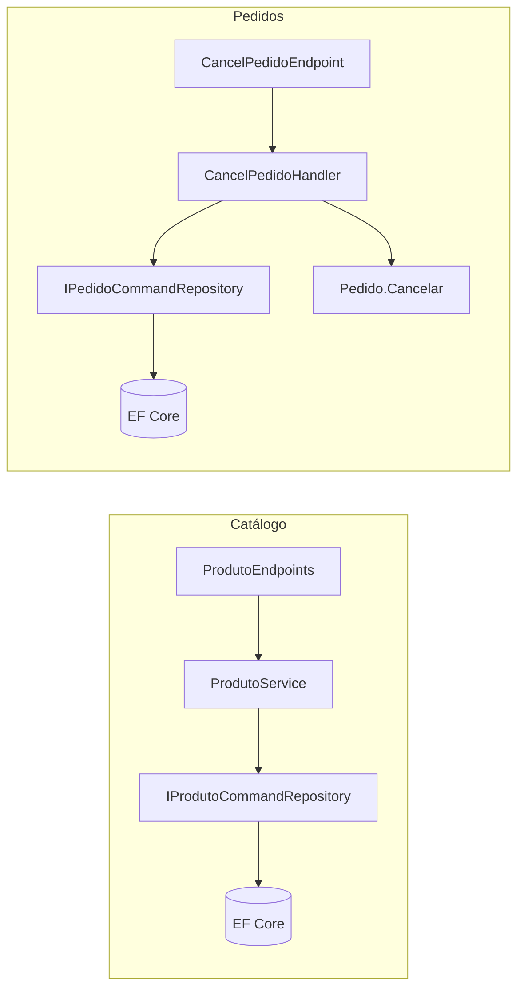

# ODA 20 — Vertical Slice e comparativo com Clean Architecture

## Objetivos de aprendizagem

- [ ] Diferenciar a organização por camada técnica, usada no Catálogo, da organização por caso de uso, usada em Pedidos.
- [ ] Rastrear o caminho de uma requisição de cancelamento de pedido, do endpoint ao agregado.
- [ ] Comparar o custo de uma mudança nos dois padrões a partir do quadro de `docs/01-ARQUITETURA.md`.
- [ ] Implementar o caso de uso de confirmação de pedido como uma nova fatia vertical, com teste de integração.

## Conceito

O `net-minimal-api` reúne três bounded contexts na mesma API .NET 10, cada um organizado por um padrão diferente, para que os dois estilos possam ser comparados sobre o mesmo stack. O Catálogo segue uma Clean Architecture híbrida, dividida nos subprojetos `Catalogo.Domain`, `Catalogo.Application`, `Catalogo.Infrastructure` e `Catalogo.API`. Pedidos segue a Vertical Slice Architecture, com uma pasta por caso de uso (`CreatePedido`, `GetPedido`, `ListPedidos`, `AddItemPedido` e `CancelPedido`), cada uma reunindo comando, handler, validador e endpoint. O terceiro contexto, Pix, simula uma integração externa e é tratado na ODA 26.

Na Clean Architecture, o código de um recurso se distribui entre camadas técnicas, e a dependência aponta da API para a aplicação e da aplicação para o domínio. Na Vertical Slice, o código de um caso de uso fica junto, e a fatia depende apenas do agregado de domínio e das interfaces de repositório compartilhadas pelo contexto.



O quadro comparativo de `docs/01-ARQUITETURA.md` resume as diferenças que mais afetam o trabalho diário:

| Dimensão | Catálogo (Clean Architecture) | Pedidos (Vertical Slice) |
| --- | --- | --- |
| Localização de um novo endpoint | Quatro subprojetos diferentes | Uma pasta isolada |
| Acréscimo de um campo | Domain, Application (DTO, validador e serviço), Infrastructure e API | Domain e a fatia específica |
| Tratamento de erro | Exceção e middleware global | Padrão `Result`, sem exceção para erro de negócio |
| Teste unitário | Serviço testado com repositório substituído | Agregado testado diretamente, sem infraestrutura |
| Custo inicial | Alto, com quatro projetos, interfaces e repositórios | Baixo, com uma pasta por funcionalidade |

O mesmo documento registra que os padrões não são mutuamente exclusivos. Recomenda Clean Architecture para recursos com muitas variações de consulta e Vertical Slice para operações com lógica de negócio densa e evolução independente.

## No código

O handler de cancelamento carrega o agregado, delega a regra a `Pedido.Cancelar` e grava a alteração. Falhas de negócio retornam `Result.Fail`, sem exceção.

Arquivo: `src/Pedidos/CancelPedido/CancelPedidoCommand.cs` (commit `702145a`)

```csharp
using ProdutosAPI.Shared.Common;
using ProdutosAPI.Pedidos.Common;
using ProdutosAPI.Pedidos.Repositories;

namespace ProdutosAPI.Pedidos.CancelPedido;

public record CancelPedidoRequest(string Motivo);

public record CancelPedidoCommand(int PedidoId, string Motivo);

public class CancelPedidoHandler(IPedidoCommandRepository repository)
{
    public async Task<Result<PedidoResponse>> HandleAsync(
        CancelPedidoCommand cmd, CancellationToken ct = default)
    {
        var pedido = await repository.ObterPorIdAsync(cmd.PedidoId, ct);

        if (pedido is null)
            return Result<PedidoResponse>.Fail("Pedido não encontrado.");

        var resultado = pedido.Cancelar(cmd.Motivo);
        if (!resultado.IsSuccess)
            return Result<PedidoResponse>.Fail(resultado.Error!);

        await repository.SaveChangesAsync(ct);
        return Result<PedidoResponse>.Ok(PedidoResponse.From(pedido));
    }
}
```

O endpoint da mesma fatia traduz o `Result` em código HTTP: 404 quando a mensagem indica pedido não encontrado, 400 para as demais falhas e 200 com o pedido atualizado.

Arquivo: `src/Pedidos/CancelPedido/CancelPedidoEndpoint.cs` (commit `702145a`)

```csharp
public class CancelPedidoEndpoint : IEndpoint
{
    public void MapEndpoints(IEndpointRouteBuilder app)
    {
        app.MapPost("/api/v1/pedidos/{id:int}/cancelar", async (
            int id,
            CancelPedidoRequest request,
            CancelPedidoHandler handler,
            CancellationToken ct) =>
        {
            var cmd = new CancelPedidoCommand(id, request.Motivo);
            var result = await handler.HandleAsync(cmd, ct);

            if (!result.IsSuccess)
            {
                return result.Error!.Contains("não encontrado", StringComparison.OrdinalIgnoreCase)
                    ? Results.NotFound(new { error = result.Error })
                    : Results.BadRequest(new { error = result.Error });
            }
            return Results.Ok(result.Value);
        })
        .WithName("CancelarPedido")
        .WithTags("Pedidos")
        .WithSummary("Cancelar pedido")
        .Produces<PedidoResponse>(StatusCodes.Status200OK)
        .Produces(StatusCodes.Status400BadRequest)
        .Produces(StatusCodes.Status404NotFound)
        .RequireAuthorization();
    }
}
```

Cada fatia implementa `IEndpoint`, e a API descobre os endpoints por reflexão na inicialização, sem lista manual de rotas.

Arquivo: `src/Shared/Common/IEndpoint.cs` (commit `702145a`)

```csharp
public interface IEndpoint
{
    void MapEndpoints(IEndpointRouteBuilder app);
}
```

Arquivo: `src/Shared/Common/EndpointExtensions.cs` (commit `702145a`)

```csharp
    public static WebApplication MapRegisteredEndpoints(this WebApplication app)
    {
        var endpoints = app.Services.GetServices<IEndpoint>();
        foreach (var endpoint in endpoints)
            endpoint.MapEndpoints(app);

        return app;
    }
```

Os handlers, ao contrário dos endpoints, são registrados um a um no contêiner de injeção de dependência.

Arquivo: `Program.cs` (commit `702145a`)

```csharp
// Handlers dos slices de Pedidos
builder.Services.AddScoped<CreatePedidoHandler>();
builder.Services.AddScoped<GetPedidoHandler>();
builder.Services.AddScoped<ListPedidosHandler>();
builder.Services.AddScoped<AddItemHandler>();
builder.Services.AddScoped<CancelPedidoHandler>();
```

## Simulador

O passo a passo acompanha uma requisição `POST /api/v1/pedidos/{id}/cancelar` desde a inicialização da API até a resposta.

<div data-oda="passo-a-passo">
<script type="application/json">
{"etapas": [
 {"titulo": "Descoberta dos endpoints", "descricao": "Na inicialização, `AddEndpointsFromAssembly` procura no assembly todas as classes concretas que implementam `IEndpoint` e registra cada uma no contêiner.",
  "codigo": {"arquivo": "Program.cs (linha 88)", "linhas": ["// Registrar slices de Pedidos via scan automático", "builder.Services.AddEndpointsFromAssembly(typeof(Program).Assembly);"], "destaque": [2]}},
 {"titulo": "Mapeamento da rota", "descricao": "`MapRegisteredEndpoints` obtém os endpoints registrados e chama `MapEndpoints` de cada um, e é assim que `CancelPedidoEndpoint` declara a rota de cancelamento.",
  "codigo": {"arquivo": "src/Shared/Common/EndpointExtensions.cs", "linhas": ["var endpoints = app.Services.GetServices<IEndpoint>();", "foreach (var endpoint in endpoints)", "    endpoint.MapEndpoints(app);"], "destaque": [3]}},
 {"titulo": "Vinculação dos parâmetros", "descricao": "A Minimal API lê `id` da rota, `request` do corpo JSON e obtém `CancelPedidoHandler` do contêiner, porque o tipo está registrado como serviço.",
  "codigo": {"arquivo": "src/Pedidos/CancelPedido/CancelPedidoEndpoint.cs", "linhas": ["app.MapPost(\"/api/v1/pedidos/{id:int}/cancelar\", async (", "    int id,", "    CancelPedidoRequest request,", "    CancelPedidoHandler handler,", "    CancellationToken ct) =>"], "destaque": [2, 3, 4]}},
 {"titulo": "Carga do agregado", "descricao": "O handler busca o pedido pelo repositório de escrita e devolve falha quando o pedido não existe.",
  "codigo": {"arquivo": "src/Pedidos/CancelPedido/CancelPedidoCommand.cs", "linhas": ["var pedido = await repository.ObterPorIdAsync(cmd.PedidoId, ct);", "", "if (pedido is null)", "    return Result<PedidoResponse>.Fail(\"Pedido não encontrado.\");"], "destaque": [1, 3, 4]}},
 {"titulo": "Regra de negócio no agregado", "descricao": "`Pedido.Cancelar` recusa pedido já cancelado e motivo vazio, e o handler repassa a falha sem lançar exceção.",
  "codigo": {"arquivo": "src/Pedidos/CancelPedido/CancelPedidoCommand.cs", "linhas": ["var resultado = pedido.Cancelar(cmd.Motivo);", "if (!resultado.IsSuccess)", "    return Result<PedidoResponse>.Fail(resultado.Error!);", "", "await repository.SaveChangesAsync(ct);"], "destaque": [1, 5]}},
 {"titulo": "Tradução em resposta HTTP", "descricao": "O endpoint converte a falha em 404 ou 400 conforme a mensagem e devolve 200 com o pedido quando a operação tem sucesso.",
  "codigo": {"arquivo": "src/Pedidos/CancelPedido/CancelPedidoEndpoint.cs", "linhas": ["if (!result.IsSuccess)", "{", "    return result.Error!.Contains(\"não encontrado\", StringComparison.OrdinalIgnoreCase)", "        ? Results.NotFound(new { error = result.Error })", "        : Results.BadRequest(new { error = result.Error });", "}", "return Results.Ok(result.Value);"], "destaque": [3, 4, 5, 7]}}
]}
</script>
</div>

A comparação mostra os arquivos tipicamente tocados ao acrescentar um campo a um recurso em cada contexto.

<div data-oda="comparacao">
<script type="application/json">
{"esquerda": {"titulo": "Catálogo (Clean Architecture)", "linhas": [
  "Catalogo.Domain/Produto.cs",
  "Catalogo.Application/DTOs/Produto/ProdutoDTO.cs",
  "Catalogo.Application/Validators/ProdutoValidator.cs",
  "Catalogo.Application/Services/ProdutoService.cs",
  "Catalogo.Application/Mappings/ProdutoMappingProfile.cs",
  "Catalogo.Infrastructure/Queries/DapperProdutoQueryRepository.cs",
  "Catalogo.API/Endpoints/Produtos/ProdutoEndpoints.cs"]},
 "direita": {"titulo": "Pedidos (Vertical Slice)", "linhas": [
  "Pedidos/Domain/Pedido.cs",
  "Pedidos/Common/PedidoResponse.cs",
  "Pedidos/CancelPedido/CancelPedidoCommand.cs",
  "Pedidos/CancelPedido/CancelPedidoEndpoint.cs"]},
 "notas": ["A lista ilustra a linha \"Quando adicionar campo\" do quadro de `docs/01-ARQUITETURA.md`, e a quantidade exata de arquivos depende do campo acrescentado.",
  "Em Pedidos, as alterações fora do domínio ficam restritas à fatia afetada e ao contrato de resposta comum."]}
</script>
</div>

O classificador associa arquivos reais do repositório ao padrão que os organiza.

<div data-oda="classificador">
<script type="application/json">
{"enunciado": "Associe cada arquivo à forma de organização a que ele pertence.",
 "categorias": [{"id": "camada", "rotulo": "Camada do Catálogo"}, {"id": "fatia", "rotulo": "Fatia de Pedidos"}, {"id": "compartilhado", "rotulo": "Infraestrutura compartilhada"}],
 "itens": [
  {"texto": "`src/Catalogo/Catalogo.Application/Services/ProdutoService.cs`", "categoria": "camada", "explicacao": "O serviço de aplicação pertence à camada Application do Catálogo e atende vários endpoints."},
  {"texto": "`src/Catalogo/Catalogo.Infrastructure/Queries/DapperProdutoQueryRepository.cs`", "categoria": "camada", "explicacao": "O repositório de leitura com Dapper fica na camada Infrastructure."},
  {"texto": "`src/Catalogo/Catalogo.Domain/ValueObjects/SKU.cs`", "categoria": "camada", "explicacao": "O value object pertence à camada Domain do Catálogo."},
  {"texto": "`src/Pedidos/CancelPedido/CancelPedidoEndpoint.cs`", "categoria": "fatia", "explicacao": "O endpoint fica dentro da pasta do caso de uso de cancelamento."},
  {"texto": "`src/Pedidos/CreatePedido/CreatePedidoValidator.cs`", "categoria": "fatia", "explicacao": "O validador fica junto ao comando e ao endpoint da fatia de criação."},
  {"texto": "`src/Pedidos/ListPedidos/ListPedidosQuery.cs`", "categoria": "fatia", "explicacao": "A consulta pertence à fatia de listagem."},
  {"texto": "`src/Shared/Common/IEndpoint.cs`", "categoria": "compartilhado", "explicacao": "O contrato de auto-registro é usado por todas as fatias."},
  {"texto": "`src/Shared/Middleware/IdempotencyMiddleware.cs`", "categoria": "compartilhado", "explicacao": "O middleware de idempotência atua sobre todas as requisições, independentemente do contexto."}
 ]}
</script>
</div>

## Laboratório

O laboratório cria o caso de uso de confirmação de pedido. O agregado `Pedido` já tem o método `Confirmar()`, com três regras (somente pedido em rascunho, ao menos um item e valor mínimo de R$ 10,00), mas o repositório não tem a fatia que expõe essa operação pela API. São necessários o .NET SDK 10.0.103 ou superior e o Git.

1. Clone o repositório e posicione-o no commit de referência.

    ```bash
    git clone https://github.com/arkhibr/net-minimal-api
    cd net-minimal-api
    git checkout 702145a
    ```

2. Rode os testes de cancelamento para confirmar o ambiente. O resultado esperado é `Aprovado: 3` e `Com falha: 0` (ou `Passed: 3` em sistema configurado em inglês).

    ```bash
    dotnet test tests/ProdutosAPI.Tests --filter CancelPedidoTests
    ```

3. Crie a pasta `src/Pedidos/ConfirmarPedido/` com o comando e o handler.

    ```csharp
    // src/Pedidos/ConfirmarPedido/ConfirmarPedidoCommand.cs
    using ProdutosAPI.Shared.Common;
    using ProdutosAPI.Pedidos.Common;
    using ProdutosAPI.Pedidos.Repositories;

    namespace ProdutosAPI.Pedidos.ConfirmarPedido;

    public record ConfirmarPedidoCommand(int PedidoId);

    public class ConfirmarPedidoHandler(IPedidoCommandRepository repository)
    {
        public async Task<Result<PedidoResponse>> HandleAsync(
            ConfirmarPedidoCommand cmd, CancellationToken ct = default)
        {
            var pedido = await repository.ObterPorIdAsync(cmd.PedidoId, ct);

            if (pedido is null)
                return Result<PedidoResponse>.Fail("Pedido não encontrado.");

            var resultado = pedido.Confirmar();
            if (!resultado.IsSuccess)
                return Result<PedidoResponse>.Fail(resultado.Error!);

            await repository.SaveChangesAsync(ct);
            return Result<PedidoResponse>.Ok(PedidoResponse.From(pedido));
        }
    }
    ```

4. Na mesma pasta, crie o endpoint. Ele segue o padrão do cancelamento, sem corpo na requisição.

    ```csharp
    // src/Pedidos/ConfirmarPedido/ConfirmarPedidoEndpoint.cs
    using ProdutosAPI.Shared.Common;
    using ProdutosAPI.Pedidos.Common;

    namespace ProdutosAPI.Pedidos.ConfirmarPedido;

    public class ConfirmarPedidoEndpoint : IEndpoint
    {
        public void MapEndpoints(IEndpointRouteBuilder app)
        {
            app.MapPost("/api/v1/pedidos/{id:int}/confirmar", async (
                int id,
                ConfirmarPedidoHandler handler,
                CancellationToken ct) =>
            {
                var result = await handler.HandleAsync(new ConfirmarPedidoCommand(id), ct);

                if (!result.IsSuccess)
                {
                    return result.Error!.Contains("não encontrado", StringComparison.OrdinalIgnoreCase)
                        ? Results.NotFound(new { error = result.Error })
                        : Results.BadRequest(new { error = result.Error });
                }
                return Results.Ok(result.Value);
            })
            .WithName("ConfirmarPedido")
            .WithTags("Pedidos")
            .WithSummary("Confirmar pedido")
            .Produces<PedidoResponse>(StatusCodes.Status200OK)
            .Produces(StatusCodes.Status400BadRequest)
            .Produces(StatusCodes.Status404NotFound)
            .RequireAuthorization();
        }
    }
    ```

5. Crie o teste de integração em `tests/ProdutosAPI.Tests/Integration/Pedidos/ConfirmarPedidoTests.cs`, tomando como modelo `CancelPedidoTests.cs` da mesma pasta. O terceiro teste confere também a mensagem de domínio, para não aceitar um 400 produzido por outro motivo.

    ```csharp
    using System.Net;
    using System.Net.Http.Headers;
    using System.Net.Http.Json;
    using FluentAssertions;
    using ProdutosAPI.Pedidos.Common;
    using ProdutosAPI.Pedidos.CreatePedido;
    using Xunit;

    namespace ProdutosAPI.Tests.Integration.Pedidos;

    public class ConfirmarPedidoTests : IClassFixture<ApiFactory>
    {
        private readonly HttpClient _client;

        public ConfirmarPedidoTests(ApiFactory factory)
        {
            _client = factory.CreateClient();
        }

        private async Task AuthenticateAsync()
        {
            var token = await AuthHelper.ObterTokenAsync(_client);
            _client.DefaultRequestHeaders.Authorization = new AuthenticationHeaderValue("Bearer", token);
        }

        private async Task<PedidoResponse> CriarPedidoAsync()
        {
            var create = await _client.PostAsJsonAsync("/api/v1/pedidos", new CreatePedidoCommand([new(1, 1)]));
            return (await create.Content.ReadFromJsonAsync<PedidoResponse>())!;
        }

        [Fact]
        public async Task POST_Confirmar_PedidoInexistente_Retorna404()
        {
            await AuthenticateAsync();
            var response = await _client.PostAsync("/api/v1/pedidos/99999/confirmar", null);
            response.StatusCode.Should().Be(HttpStatusCode.NotFound);
        }

        [Fact]
        public async Task POST_Confirmar_PedidoEmRascunho_Retorna200EConfirma()
        {
            await AuthenticateAsync();
            var pedido = await CriarPedidoAsync();

            var response = await _client.PostAsync($"/api/v1/pedidos/{pedido.Id}/confirmar", null);

            response.StatusCode.Should().Be(HttpStatusCode.OK);
            var confirmado = await response.Content.ReadFromJsonAsync<PedidoResponse>();
            confirmado!.Status.Should().Be("Confirmado");
            confirmado.ConfirmadoEm.Should().NotBeNull();
        }

        [Fact]
        public async Task POST_Confirmar_DuasVezes_Retorna400()
        {
            await AuthenticateAsync();
            var pedido = await CriarPedidoAsync();
            await _client.PostAsync($"/api/v1/pedidos/{pedido.Id}/confirmar", null);

            var response = await _client.PostAsync($"/api/v1/pedidos/{pedido.Id}/confirmar", null);

            response.StatusCode.Should().Be(HttpStatusCode.BadRequest);
            var corpo = await response.Content.ReadAsStringAsync();
            corpo.Should().Contain("Apenas pedidos em rascunho podem ser confirmados.");
        }
    }
    ```

6. Rode os testes da nova fatia antes de registrar o handler. O resultado esperado no commit de referência é `Com falha: 3`, com respostas 400 de corpo vazio, efeito descrito na seção de erros comuns.

    ```bash
    dotnet test tests/ProdutosAPI.Tests --filter ConfirmarPedidoTests
    ```

7. Em `Program.cs`, acrescente `using ProdutosAPI.Pedidos.ConfirmarPedido;` aos `using` do topo e registre o handler logo após `builder.Services.AddScoped<CancelPedidoHandler>();`.

    ```csharp
    builder.Services.AddScoped<ConfirmarPedidoHandler>();
    ```

8. Rode de novo os testes da fatia e depois a suíte inteira. Os resultados esperados são `Aprovado: 3` para a fatia e `Aprovado: 146`, sem falhas, para o projeto `ProdutosAPI.Tests`.

    ```bash
    dotnet test tests/ProdutosAPI.Tests --filter ConfirmarPedidoTests
    dotnet test tests/ProdutosAPI.Tests
    ```

A fatia nova tocou apenas a pasta `ConfirmarPedido`, o arquivo de teste e duas linhas de `Program.cs`, sem nenhuma alteração no domínio, que já continha a regra.

## Erros comuns

| Sintoma | Causa | Correção |
| --- | --- | --- |
| Todas as chamadas ao novo endpoint retornam 400 com corpo vazio, sem exceção na inicialização. | O handler não foi registrado com `AddScoped`. Pela regra de precedência da Minimal API, um parâmetro cujo tipo não é serviço registrado é lido do corpo da requisição, e a ausência de corpo produz 400. | Registrar o handler em `Program.cs`, como no passo 7. |
| Um teste que espera 400 passa mesmo com a fatia quebrada. | O teste confere apenas o código de status, e o 400 vem de outro motivo, como a vinculação descrita acima. | Conferir também a mensagem de domínio no corpo da resposta, como no terceiro teste do laboratório. |
| O endpoint responde 404 a uma chamada sem token, em vez de 401. | A linha `.RequireAuthorization()` foi omitida, e o endpoint passa a executar sem autenticação. O comportamento foi observado no commit de referência, com 401 quando a linha está presente. | Manter `.RequireAuthorization()` em todo endpoint de Pedidos, como nas fatias existentes. |
| Os testes de `tests/Pedidos.Tests/Endpoints/` passam, mas não detectam erro nenhum na API. | No commit de referência, esses testes atribuem o código de status a uma variável e conferem a própria variável, sem chamar a API, e descrevem `PATCH` com 204, 409 e 422, enquanto o endpoint real é `POST` com 200, 400 ou 404. | Usar como modelo os testes de `tests/ProdutosAPI.Tests/Integration/Pedidos/`, que chamam a API em memória com `ApiFactory`. |

## Decisão arquitetural

!!! abstract "ADR-0001 — Coexistência de Clean Architecture e Vertical Slice Architecture"

    **Contexto:** os engenheiros lidam com domínios de complexidade variada, alguns com regras simples e alta taxa de mudança, outros com regras complexas e necessidade de testabilidade isolada, e o projeto precisava escolher o padrão de base.

    **Decisão:** coexistência intencional dos dois padrões em contextos distintos, com Pedidos em Vertical Slice e Catálogo em Clean Architecture, para expor os engenheiros aos dois estilos no mesmo código.

    **Alternativas avaliadas:** Vertical Slice para toda a aplicação e Clean Architecture para toda a aplicação, ambas descartadas porque impediriam a comparação lado a lado sobre o mesmo stack.

    **Consequências:** a comparação dos padrões em contexto real é o ganho principal, enquanto a carga cognitiva para novos contribuidores aumenta e regras compartilhadas, como validação e autenticação, precisam funcionar com as duas organizações de código.

!!! abstract "ADR-0011 — Arquitetura híbrida no Catálogo"

    **Contexto:** o Catálogo passou a ter cinco recursos com regras de domínio ricas, e a estrutura plana anterior não escalava para essa complexidade.

    **Decisão:** manter Domain, Application e Infrastructure em Clean Architecture e organizar a camada de API com um arquivo por grupo de endpoints, no estilo Vertical Slice.

    **Alternativas avaliadas:** Clean Architecture pura, com alto custo de implementação para endpoints simples, e Vertical Slice pura, com duplicação de código de domínio entre funcionalidades do mesmo contexto.

    **Consequências:** domínio e aplicação são reutilizados por todos os endpoints e cada endpoint evolui de forma independente, ao custo de mais arquivos e do risco de mistura de responsabilidades quando a disciplina de camadas não é mantida.

## Verificação

<div data-oda="quiz">
<script type="application/json">
{"perguntas": [
 {"enunciado": "Qual afirmação diferencia corretamente as duas organizações do repositório?",
  "alternativas": [
   {"texto": "O Catálogo distribui um recurso por camadas técnicas, e Pedidos agrupa tudo de um caso de uso numa pasta.", "correta": true, "explicacao": "É a diferença registrada na ADR-0001 e no quadro de `docs/01-ARQUITETURA.md`."},
   {"texto": "Pedidos não tem domínio, porque cada fatia contém sua própria regra de negócio.", "correta": false, "explicacao": "Pedidos tem o agregado `Pedido` em `src/Pedidos/Domain/`, compartilhado pelas fatias."},
   {"texto": "O Catálogo não usa Vertical Slice em nenhuma parte.", "correta": false, "explicacao": "A ADR-0011 organiza a camada de API do Catálogo com um arquivo por grupo de endpoints, no estilo Vertical Slice."}]},
 {"enunciado": "No cancelamento de um pedido inexistente, onde nasce a resposta 404?",
  "alternativas": [
   {"texto": "No endpoint, que traduz a falha \"Pedido não encontrado.\" devolvida pelo handler.", "correta": true, "explicacao": "O handler retorna `Result.Fail` e o endpoint escolhe `Results.NotFound` pela mensagem."},
   {"texto": "No agregado, que lança uma exceção capturada pelo middleware.", "correta": false, "explicacao": "Pedidos usa o padrão `Result` e não lança exceção para erro de negócio."},
   {"texto": "No repositório, que retorna 404 diretamente.", "correta": false, "explicacao": "O repositório retorna `null`, e quem decide a resposta HTTP é o endpoint."}]},
 {"enunciado": "Segundo o quadro de `docs/01-ARQUITETURA.md`, o que muda ao acrescentar um campo em cada contexto?",
  "alternativas": [
   {"texto": "No Catálogo a mudança atravessa Domain, Application, Infrastructure e API, e em Pedidos fica no domínio e na fatia afetada.", "correta": true, "explicacao": "É a linha \"Quando adicionar campo\" do quadro comparativo."},
   {"texto": "Nos dois contextos a mudança se limita ao domínio.", "correta": false, "explicacao": "DTOs, validadores e respostas também mudam, em quantidade diferente em cada padrão."},
   {"texto": "Em Pedidos a mudança exige alterar todas as fatias.", "correta": false, "explicacao": "Somente a fatia afetada e o contrato de resposta comum mudam."}]},
 {"enunciado": "Depois de criar a fatia `ConfirmarPedido`, todas as chamadas retornam 400 com corpo vazio. Qual é a causa mais provável?",
  "alternativas": [
   {"texto": "O handler não foi registrado no contêiner, e a Minimal API tenta ler o parâmetro do corpo da requisição.", "correta": true, "explicacao": "A regra de precedência lê do corpo o parâmetro que não é serviço registrado, e a falta de corpo gera 400."},
   {"texto": "O endpoint não foi descoberto por `MapRegisteredEndpoints`.", "correta": false, "explicacao": "Endpoint não mapeado responderia 404, e não 400."},
   {"texto": "O pedido já estava confirmado.", "correta": false, "explicacao": "Essa falha traria a mensagem de domínio no corpo, e o corpo está vazio."}]}
]}
</script>
</div>

## Referências

- [ADR-0001 — Coexistência de Clean Architecture e Vertical Slice Architecture](https://github.com/arkhibr/net-minimal-api/blob/702145a/docs/ADRs/ADR-0001-coexistencia-clean-architecture-vertical-slice.md)
- [ADR-0011 — Arquitetura híbrida Clean e Vertical Slice](https://github.com/arkhibr/net-minimal-api/blob/702145a/docs/ADRs/ADR-0011-arquitetura-hibrida-clean-vertical-slice.md)
- [`docs/00-VISAO-GERAL.md`](https://github.com/arkhibr/net-minimal-api/blob/702145a/docs/00-VISAO-GERAL.md) e [`docs/01-ARQUITETURA.md`](https://github.com/arkhibr/net-minimal-api/blob/702145a/docs/01-ARQUITETURA.md)
- [Parameter binding in Minimal API applications, seção "Binding Precedence"](https://learn.microsoft.com/en-us/aspnet/core/fundamentals/minimal-apis/parameter-binding)
- [Jimmy Bogard, "Vertical Slice Architecture"](https://www.jimmybogard.com/vertical-slice-architecture/)
