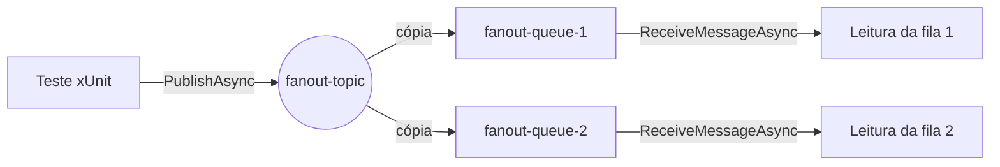

# ODA 30 — Mensageria com SQS e SNS

## Objetivos de aprendizagem

- [ ] Diferenciar fila (SQS), que entrega cada mensagem a um consumidor, de tópico (SNS), que distribui cópias a todos os assinantes.
- [ ] Explicar o fan-out de SNS para SQS e o papel da política de acesso da fila.
- [ ] Executar os cenários de mensageria contra o LocalStack orquestrado pelo Aspire.
- [ ] Estender o cenário de fan-out com uma nova fila assinante e verificar a entrega.

## Conceito

O Amazon SQS é um serviço de filas. Uma mensagem enviada a uma fila permanece armazenada até que um consumidor a receba e a apague, e cada mensagem é processada por um único consumidor. O Amazon SNS é um serviço de tópicos. Uma mensagem publicada num tópico é copiada para todos os assinantes daquele tópico no momento da publicação, e o tópico não guarda a mensagem para assinantes que ainda não existem.

A combinação dos dois serviços produz o padrão de fan-out: o produtor publica uma vez no tópico, e cada fila assinante recebe a própria cópia, consumida no ritmo de cada consumidor. Para que o SNS consiga gravar na fila, a fila precisa de uma política de acesso que autorize a ação `sqs:SendMessage` para o serviço `sns.amazonaws.com`, restrita ao ARN do tópico de origem. O cenário 10 mostra outra origem de eventos para uma fila, com notificações de objetos criados no S3.

No repositório `aspire-aws`, os testes não usam uma conta AWS. O projeto `src/AppHost` declara um contêiner `localstack/localstack:3.8`, que emula os serviços na porta 4566, e a classe `LocalStackFixture` sobe esse ambiente pelo Aspire antes de cada cenário e o encerra ao final. Os cenários rodam um de cada vez, porque compartilham a porta 4566, decisão registrada na ADR-004.



## No código

A preparação do cenário 09 cria o tópico e as duas filas e, para cada fila, grava a política de acesso e inscreve a fila no tópico.

Arquivo: `scenarios/09-SNS.SQS.Fanout/Fixture.cs` (commit `50a5344`)

```csharp
    protected override async Task InitializeScenarioAsync()
    {
        SNS = AwsClientFactory.SNS();
        SQS = AwsClientFactory.SQS();

        TopicArn = (await SNS.CreateTopicAsync("fanout-topic")).TopicArn;
        Queue1Url = (await SQS.CreateQueueAsync("fanout-queue-1")).QueueUrl;
        Queue2Url = (await SQS.CreateQueueAsync("fanout-queue-2")).QueueUrl;

        foreach (var queueUrl in new[] { Queue1Url, Queue2Url })
        {
            var queueArn = (await SQS.GetQueueAttributesAsync(queueUrl, ["QueueArn"])).Attributes["QueueArn"];

            await SQS.SetQueueAttributesAsync(new SetQueueAttributesRequest
            {
                QueueUrl = queueUrl,
                Attributes = new Dictionary<string, string>
                {
                    ["Policy"] = BuildQueuePolicy(queueArn, TopicArn)
                }
            });

            await SNS.SubscribeAsync(new SubscribeRequest
            {
                TopicArn = TopicArn,
                Protocol = "sqs",
                Endpoint = queueArn
            });
        }
    }
```

A política autoriza o SNS a enviar mensagens para a fila somente quando a origem é o tópico do cenário.

Arquivo: `scenarios/09-SNS.SQS.Fanout/Fixture.cs` (commit `50a5344`)

```csharp
    private static string BuildQueuePolicy(string queueArn, string topicArn)
    {
        return $$"""
        {
          "Version": "2012-10-17",
          "Statement": [
            {
              "Sid": "AllowSnsFanout",
              "Effect": "Allow",
              "Principal": { "Service": "sns.amazonaws.com" },
              "Action": "sqs:SendMessage",
              "Resource": "{{queueArn}}",
              "Condition": {
                "ArnEquals": { "aws:SourceArn": "{{topicArn}}" }
              }
            }
          ]
        }
        """;
    }
```

O teste publica uma mensagem e verifica que cada fila recebeu exatamente uma cópia, aguardando até 5 segundos por fila.

Arquivo: `scenarios/09-SNS.SQS.Fanout/SnsSqsFanoutTests.cs` (commit `50a5344`)

```csharp
public class SnsSqsFanoutTests(Fixture fixture, ITestOutputHelper output) : IClassFixture<Fixture>
{
    [Fact]
    public async Task Publish_ShouldDeliverMessageToBothQueues()
    {
        output.WriteLine($">>> SNS.Publish: publicando 'broadcast event' no tópico '{fixture.TopicArn}'");
        output.WriteLine("    O tópico tem duas filas SQS inscritas — cada publicação entrega uma cópia para cada fila (fanout)");
        await fixture.SNS.PublishAsync(fixture.TopicArn, "broadcast event");

        foreach (var queueUrl in new[] { fixture.Queue1Url, fixture.Queue2Url })
        {
            output.WriteLine($">>> SQS.ReceiveMessage: verificando entrega na fila '{queueUrl}'");
            var messages = await fixture.SQS.ReceiveMessageAsync(new ReceiveMessageRequest
            {
                QueueUrl = queueUrl,
                MaxNumberOfMessages = 1,
                WaitTimeSeconds = 5
            });
            output.WriteLine($"    Mensagens recebidas: {messages.Messages.Count}");

            Assert.Single(messages.Messages);
            Assert.Contains("broadcast event", messages.Messages[0].Body);
        }
    }
}
```

O AppHost declara o contêiner do LocalStack com os serviços emulados e a porta 4566. A montagem do socket do Docker permite que o LocalStack crie contêineres de Lambda nos cenários que usam funções.

Arquivo: `src/AppHost/Program.cs` (commit `50a5344`)

```csharp
    builder
        .AddContainer("localstack", "localstack/localstack", "3.8")
        .WithEnvironment("AWS_ACCESS_KEY_ID", "test")
        .WithEnvironment("AWS_DEFAULT_REGION", "us-east-1")
        .WithEnvironment("AWS_SECRET_ACCESS_KEY", "test")
        .WithEnvironment("SERVICES", "s3,sqs,sns,dynamodb,lambda,ssm,secretsmanager,events,scheduler,stepfunctions,rds,ecs")
        .WithEnvironment("LAMBDA_REMOVE_CONTAINERS", "true")
        .WithEnvironment("LAMBDA_RUNTIME_ENVIRONMENT_TIMEOUT", "120")
        .WithEnvironment("DOCKER_HOST", "unix:///var/run/docker.sock")
        .WithBindMount("/var/run/docker.sock", "/var/run/docker.sock")
        .WithHttpEndpoint(port: 4566, targetPort: 4566, name: "gateway", isProxied: false);
```

## Simulador

A linha do tempo reproduz o cenário 09. As falhas simuladas mostram o que acontece quando a leitura de uma fila não é executada e quando o teste não publica a mensagem.

<div data-oda="linha-do-tempo">
<script type="application/json">
{"atores": [
  {"id": "teste", "rotulo": "Teste (produtor)"},
  {"id": "topico", "rotulo": "Tópico fanout-topic"},
  {"id": "fila1", "rotulo": "Fila fanout-queue-1"},
  {"id": "fila2", "rotulo": "Fila fanout-queue-2"},
  {"id": "leitor1", "rotulo": "Leitura da fila 1"},
  {"id": "leitor2", "rotulo": "Leitura da fila 2"}],
 "eventos": [
  {"id": "e1", "de": "teste", "para": "topico", "mensagem": "`PublishAsync` com \"broadcast event\""},
  {"id": "e2", "de": "topico", "para": "fila1", "mensagem": "cópia da mensagem para a assinatura da fila 1", "depende": "e1"},
  {"id": "e3", "de": "topico", "para": "fila2", "mensagem": "cópia da mensagem para a assinatura da fila 2", "depende": "e1"},
  {"id": "e4", "de": "fila1", "para": "leitor1", "mensagem": "`ReceiveMessageAsync` recebe a mensagem", "depende": "e2"},
  {"id": "e5", "de": "fila2", "para": "leitor2", "mensagem": "`ReceiveMessageAsync` recebe a mensagem", "depende": "e3"}],
 "falhas": [
  {"id": "leitor2-parado", "rotulo": "A leitura da fila 2 não é executada", "ator": "leitor2"},
  {"id": "produtor-parado", "rotulo": "O teste não publica a mensagem", "ator": "teste"}]}
</script>
</div>

O terminal reproduz as três execuções do laboratório, com as saídas obtidas no commit de referência. As URLs das filas foram mantidas como o LocalStack as devolve.

<div data-oda="terminal">
<script type="application/json">
{"titulo": "Cenário 09 original, com três filas e com a terceira fila sem assinatura",
 "passos": [
  {"comando": "dotnet test scenarios/09-SNS.SQS.Fanout/ --logger \"console;verbosity=detailed\"", "saida": " >>> SNS.Publish: publicando 'broadcast event' no tópico 'arn:aws:sns:us-east-1:000000000000:fanout-topic'\n     O tópico tem duas filas SQS inscritas — cada publicação entrega uma cópia para cada fila (fanout)\n >>> SQS.ReceiveMessage: verificando entrega na fila 'http://sqs.us-east-1.localhost.localstack.cloud:4566/000000000000/fanout-queue-1'\n     Mensagens recebidas: 1\n >>> SQS.ReceiveMessage: verificando entrega na fila 'http://sqs.us-east-1.localhost.localstack.cloud:4566/000000000000/fanout-queue-2'\n     Mensagens recebidas: 1\n     Aprovados: 1", "nota": "Cenário original: uma publicação, uma cópia em cada fila assinante."},
  {"comando": "dotnet test scenarios/09-SNS.SQS.Fanout/ --logger \"console;verbosity=detailed\"", "saida": " >>> SNS.Publish: publicando 'broadcast event' no tópico 'arn:aws:sns:us-east-1:000000000000:fanout-topic'\n     O tópico tem duas filas SQS inscritas — cada publicação entrega uma cópia para cada fila (fanout)\n >>> SQS.ReceiveMessage: verificando entrega na fila '.../fanout-queue-1'\n     Mensagens recebidas: 1\n >>> SQS.ReceiveMessage: verificando entrega na fila '.../fanout-queue-2'\n     Mensagens recebidas: 1\n >>> SQS.ReceiveMessage: verificando entrega na fila '.../fanout-queue-3'\n     Mensagens recebidas: 1\n     Aprovados: 1", "nota": "Com `fanout-queue-3` criada, autorizada e inscrita, a mesma publicação chega às três filas. A mensagem de log ainda fala em duas filas porque o texto é fixo no teste."},
  {"comando": "dotnet test scenarios/09-SNS.SQS.Fanout/ --logger \"console;verbosity=detailed\"", "saida": "Assert.Single() Failure: The collection was empty\n >>> SQS.ReceiveMessage: verificando entrega na fila '.../fanout-queue-3'\n     Mensagens recebidas: 0\n     Com falha: 1", "nota": "Com `Queue3Url` retirada apenas do laço de assinatura, a fila existe mas não recebe cópia, e o teste falha após aguardar 5 segundos."}
 ]}
</script>
</div>

## Laboratório

O laboratório exige .NET SDK 10.0.103 ou superior, Git e um Docker em execução que exponha o socket em `/var/run/docker.sock`, como o Docker Desktop. Em Windows com Docker Engine no WSL2, o repositório traz o guia `docs/docker-engine-wsl2-windows.md`.

!!! warning "Laboratório não verificado"

    Os passos abaixo não foram executados exatamente como estão escritos. O ambiente de produção desta ODA usava Colima, que não expõe `/var/run/docker.sock`, e o commit de referência falhou na subida do LocalStack, como descrito em "Erros comuns". Os resultados citados nos passos 2 a 7 foram obtidos numa cópia do repositório com a linha `.WithBindMount("/var/run/docker.sock", ...)` retirada de `src/AppHost/Program.cs`, alteração que não afeta os cenários de mensageria, porque eles não usam Lambda.

1. Clone o repositório e posicione-o no commit de referência.

    ```bash
    git clone https://github.com/arkhibr/aspire-aws
    cd aspire-aws
    git checkout 50a5344
    ```

2. Execute os quatro cenários de mensageria, um de cada vez. Os resultados esperados são 4 testes aprovados no cenário 02, 3 no cenário 04, 1 no cenário 09 e 1 no cenário 10. A primeira execução também baixa as imagens do LocalStack e do PostgreSQL.

    ```bash
    dotnet test scenarios/02-SQS.Basic/
    dotnet test scenarios/04-SNS.Basic/
    dotnet test scenarios/09-SNS.SQS.Fanout/
    dotnet test scenarios/10-S3.SQS.Notification/
    ```

3. Execute o cenário 09 com saída detalhada e localize as linhas `Mensagens recebidas: 1` de cada fila.

    ```bash
    dotnet test scenarios/09-SNS.SQS.Fanout/ --logger "console;verbosity=detailed"
    ```

4. Em `scenarios/09-SNS.SQS.Fanout/Fixture.cs`, acrescente a propriedade da terceira fila, crie a fila e inclua-a no laço que grava a política e faz a assinatura.

    ```csharp
    public string Queue3Url { get; private set; } = null!;
    ```

    ```csharp
    Queue3Url = (await SQS.CreateQueueAsync("fanout-queue-3")).QueueUrl;

    foreach (var queueUrl in new[] { Queue1Url, Queue2Url, Queue3Url })
    ```

5. Em `scenarios/09-SNS.SQS.Fanout/SnsSqsFanoutTests.cs`, inclua a terceira fila no laço de verificação.

    ```csharp
    foreach (var queueUrl in new[] { fixture.Queue1Url, fixture.Queue2Url, fixture.Queue3Url })
    ```

6. Execute o cenário 09 de novo com saída detalhada. O resultado esperado são três linhas `Mensagens recebidas: 1` e o teste aprovado.

7. Retire `Queue3Url` apenas do laço da Fixture, mantendo a fila criada e a verificação no teste, e execute o cenário outra vez. O resultado esperado é a falha `Assert.Single() Failure: The collection was empty`, com `Mensagens recebidas: 0` para `fanout-queue-3`, porque a fila existe mas não é assinante do tópico.

8. Desfaça as alterações com `git checkout -- scenarios`.

## Erros comuns

| Sintoma | Causa | Correção |
| --- | --- | --- |
| Todos os testes falham em poucos milissegundos com `System.TimeoutException : LocalStack did not become healthy within 120s.`, e o log detalhado mostra `Could not create bind mount source path ... mkdir /var/run/docker.sock: permission denied`. | O AppHost monta `/var/run/docker.sock` no contêiner do LocalStack, e o Docker em uso expõe o socket em outro caminho. O comportamento foi observado com o Colima, que usa `~/.colima/default/docker.sock`. | Usar um Docker que exponha `/var/run/docker.sock`. Com o Colima, a alternativa é criar o link `sudo ln -sf ~/.colima/default/docker.sock /var/run/docker.sock`, passo que não foi executado na produção desta ODA. Para os cenários desta ODA, que não usam Lambda, a remoção da linha `.WithBindMount(...)` numa cópia local do AppHost foi verificada e faz os quatro cenários passarem. |
| A nova fila é criada, mas não recebe mensagens e o teste falha com `Assert.Single() Failure: The collection was empty`. | A fila não foi inscrita no tópico, e o SNS só copia mensagens para assinaturas existentes no momento da publicação. | Incluir a fila no laço que grava a política e chama `SubscribeAsync`. |
| Cenários com Lambda aparecem como ignorados em macOS com processador ARM. | O README do repositório registra que Lambda no LocalStack 3.8 é instável em macOS ARM64, e os cenários 07, 08, 11, 12, 13, 14 e 16 são marcados como `Skip`. | Executar esses cenários em Linux ou na esteira de CI, como indica a seção "Limitações conhecidas" do README. |
| Dois cenários iniciados em paralelo falham por conflito de porta. | Todos os cenários usam a porta fixa 4566, conforme a ADR-004. | Executar um cenário por vez, como fazem o `test.runsettings` com `MaxCpuCount=1` e o bloqueio de arquivo da `LocalStackFixture`. |

## Decisão arquitetural

!!! abstract "ADR-003 — Tática de simulação de serviços AWS (status Proposed)"

    **Contexto:** os testes precisam interagir com vários serviços AWS, e o uso da AWS real em testes automatizados implica custo, credenciais e estado persistente entre execuções.

    **Decisão:** usar o LocalStack Community 3.8 com modo duplo, em que a variável `AWS_TARGET=aws` desvia os mesmos testes para a AWS real sem alteração de código.

    **Alternativas avaliadas:** o LocalStack Pro, com custo por desenvolvedor e licença na esteira, a AWS real em todas as execuções, com custo e gestão de credenciais, e substitutos em memória das interfaces do SDK, que não exercitam integrações como assinaturas e políticas.

    **Consequências:** os cenários rodam sem custo e sem credenciais em Linux e na esteira, enquanto Lambda em macOS ARM64 e Step Functions na edição Community ficam marcados como limitações documentadas, com os cenários afetados ignorados.

!!! abstract "ADR-004 — Tática de isolamento entre cenários de teste (status Proposed)"

    **Contexto:** dezesseis projetos de teste independentes compartilham a porta 4566, e dois cenários em paralelo tentariam subir dois contêineres LocalStack na mesma porta.

    **Decisão:** manter a porta fixa 4566 com execução sequencial, combinando `MaxCpuCount=1` no `test.runsettings` com um bloqueio de arquivo exclusivo na `LocalStackFixture`.

    **Alternativas avaliadas:** porta aleatória por cenário e rede Docker isolada por cenário, ambas com refatoração profunda e maior consumo de recursos, e a ausência de mecanismo, com falhas aleatórias por disputa de porta.

    **Consequências:** o comportamento fica determinístico e simples de entender, ao custo de uma suíte completa sequencial de cerca de três minutos, sem aproveitar múltiplos núcleos.

## Verificação

<div data-oda="quiz">
<script type="application/json">
{"perguntas": [
 {"enunciado": "Qual afirmação diferencia corretamente SQS e SNS?",
  "alternativas": [
   {"texto": "A fila guarda a mensagem até um consumidor recebê-la, e o tópico copia a mensagem para todos os assinantes no momento da publicação.", "correta": true, "explicacao": "É o comportamento observado no cenário 09: a cópia só chega às filas inscritas quando a mensagem é publicada."},
   {"texto": "O tópico guarda a mensagem até que surja um assinante.", "correta": false, "explicacao": "A fila 3 sem assinatura não recebeu cópia, e o tópico não reenviou a mensagem depois."},
   {"texto": "A fila entrega cada mensagem a todos os consumidores conectados.", "correta": false, "explicacao": "Cada mensagem de uma fila é processada por um único consumidor."}]},
 {"enunciado": "Para que serve a política gravada por `BuildQueuePolicy`?",
  "alternativas": [
   {"texto": "Autorizar o serviço SNS a enviar mensagens para a fila, apenas quando a origem é o tópico do cenário.", "correta": true, "explicacao": "A política concede `sqs:SendMessage` ao principal `sns.amazonaws.com` com a condição `aws:SourceArn` igual ao ARN do tópico."},
   {"texto": "Inscrever a fila no tópico.", "correta": false, "explicacao": "A inscrição é feita por `SubscribeAsync`, numa chamada separada."},
   {"texto": "Permitir que o teste leia a fila sem credenciais.", "correta": false, "explicacao": "A política trata do envio pelo SNS, e não da leitura pelo teste."}]},
 {"enunciado": "Todos os cenários falham com `LocalStack did not become healthy within 120s` e o log mostra `mkdir /var/run/docker.sock: permission denied`. Qual é a causa?",
  "alternativas": [
   {"texto": "O Docker em uso não expõe o socket no caminho que o AppHost monta no contêiner do LocalStack.", "correta": true, "explicacao": "O AppHost declara `.WithBindMount(\"/var/run/docker.sock\", ...)`, e o Aspire precisa que esse caminho exista na máquina."},
   {"texto": "A imagem do LocalStack ainda está sendo baixada.", "correta": false, "explicacao": "O log aponta um erro de montagem, e não de download."},
   {"texto": "A fila não tem política de acesso.", "correta": false, "explicacao": "A política só importa depois que o LocalStack está saudável e o cenário cria os recursos."}]},
 {"enunciado": "Ao estender o cenário 09, a terceira fila foi criada mas ficou fora do laço da Fixture. O que acontece?",
  "alternativas": [
   {"texto": "A fila não recebe cópia da publicação, e o teste falha em `Assert.Single`.", "correta": true, "explicacao": "Sem política e sem assinatura, o tópico não entrega a mensagem à fila 3, e a leitura volta vazia após 5 segundos."},
   {"texto": "A fila recebe a mensagem, porque está na mesma conta do tópico.", "correta": false, "explicacao": "Estar na mesma conta não cria assinatura, e o SNS só entrega para assinantes."},
   {"texto": "O teste passa, porque a verificação ignora filas sem assinatura.", "correta": false, "explicacao": "O laço de verificação inclui a fila 3 e exige exatamente uma mensagem."}]}
]}
</script>
</div>

## Referências

- [ADR-003 — Tática de simulação de serviços AWS](https://github.com/arkhibr/aspire-aws/blob/50a5344/docs/architecture/adrs/ADR-003-simulacao-servicos-aws.md)
- [ADR-004 — Tática de isolamento entre cenários de teste](https://github.com/arkhibr/aspire-aws/blob/50a5344/docs/architecture/adrs/ADR-004-isolamento-cenarios-teste.md)
- Cenários [02](https://github.com/arkhibr/aspire-aws/tree/50a5344/scenarios/02-SQS.Basic), [04](https://github.com/arkhibr/aspire-aws/tree/50a5344/scenarios/04-SNS.Basic), [09](https://github.com/arkhibr/aspire-aws/tree/50a5344/scenarios/09-SNS.SQS.Fanout) e [10](https://github.com/arkhibr/aspire-aws/tree/50a5344/scenarios/10-S3.SQS.Notification)
- [Amazon SQS Developer Guide](https://docs.aws.amazon.com/AWSSimpleQueueService/latest/SQSDeveloperGuide/welcome.html)
- [Amazon SNS: assinatura de filas SQS](https://docs.aws.amazon.com/sns/latest/dg/sns-sqs-as-subscriber.html)
- [Documentação do LocalStack](https://docs.localstack.cloud/)
